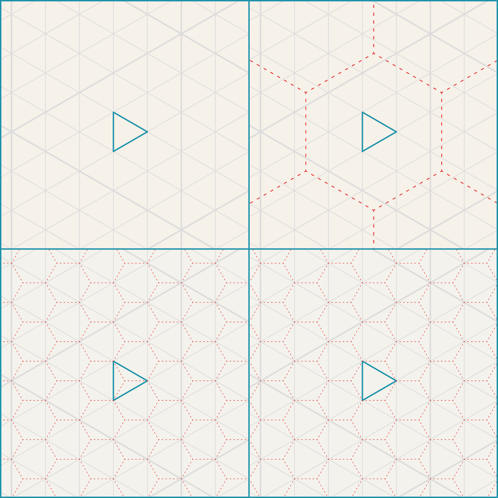

[]()
[](https://developer.apple.com/swift)
[](https://www.swift.org/documentation/package-manager/)
[](https://opensource.org/licenses/MIT)

- [Introduction](#deltille)
- [Installation](#installation)
- [Implementation](#implementation)
- [Examples](#examples)
- [Credits](#credits)

# Deltille
Deltille is a Swift library for working with hexagonal and triangular grid systems. It provides robust data structures and utilities to make grid based development simple, accurate and efficient.

Hexagonal and triangular grids are deeply related through duality:

- Every hexagonal grid can be subdivided into equilateral triangles forming a triangular grid.
- Conversely; The dual graph of a triangular grid is a hexagonal grid and vice versa.
- This makes them complementary representations of the same underlying space. You can often solve problems easily by switching between them.

By supporting both grid types in a unified API, Deltille lets you take advantage of this relationship making it easier to build flexible systems for geometry, navigation, or procedural generation.



## Features
- Hexagonal & Triangular Grids:
 - Supports both coordinate systems.
- Coordinate Conversion:
 - Easily convert between 2D Cartesian coordinates and 3D hexagonal grid coordinates.
- Neighbour & Vertex Navigation:
 - Convenient methods for traversing edge neighbours and corner vertices.
- Scaling & Transformations:
 - Built-in support for scaling grid space and handling grid math such as subdivision and rotation.
- Composable API:
 - Designed to integrate cleanly into games, simulations and visualization tools.

# Installation
To install using Swift Package Manager, add this to the `dependencies:` section in your Package.swift file:

```swift
.package(url: "https://github.com/zilmarinen/Deltille.git", branch: "main"),
```

## Dependencies
[Euclid](https://github.com/nicklockwood/Euclid) is a Swift library for creating and manipulating 3D geometry and is used extensively within this project for mesh generation and vector operations.

## License

This project is licensed under the MIT License - see the [LICENSE.md](LICENSE.md) file for details.

# Implementation
Deltille defines a `Tile` archetype of which both `Triangle` and `Hexagon` conform to provide high level utility methods for grid based operations.

## Triangles & Hexagons
The basic building blocks of Deltille are both the `Triangle` and `Hexagon` `Tile` types which are used together to model vertex positions along the `xz` plane.

```swift
// MARK: Triangle
let triangle = Triangle(.zero)
    
//generate triangle vertices for the desired scale
let vertices = triangle.vertices.map { $0.position(.tile) }

// MARK: Hexagon
let hexagon = Hexagon(.zero)

//generate hexagon vertices for the desired scale
let vertices = hexagon.vertices.map { $0.position(.tile) }
```

## Stencils & Sieves
Both a `Stencil` or `Sieve` can be used to subdivide a triangle into individual sub-triangles mapped to a specific grid scale.
 - `Stencil` defines a discrete set of subdivided triangles and their vertices in world space.
 - `Sieve` calculates a dynamic range of subdivided triangles and their vertices in grid space.

```swift
// MARK: Stencil
let stencil = triangle.stencil(.tile)

let triangles = stencil.triangles

//MARK: Sieve
let sieve = triangle.sieve(for: .chunk)

let triangles = sieve.triangles
```

## Footprints
A `Footprint` defines a collection of `Tile` types centered around a given origin.

```swift
//MARK: Footprint
let coordinates: [Coordinate] = [.zero,
                                 -.unitX,
                                 -.unitY,
                                 -.unitZ]

let footprint = Triangle.Footprint(.zero,
                                   coordinates)

//rotate footprint around its origin
let rotated = footprint.rotate(.clockwise)
```

# Examples
[Regolith](https://github.com/zilmarinen/Regolith/) makes use of the concepts introduced by Deltille to generate meshes for predefined tessellations of a triangle interior using [Ortho-Tiling](https://www.boristhebrave.com/2023/05/31/ortho-tiles/).

[Verdure](https://github.com/zilmarinen/Verdure/) implements additional mesh generation on top of Deltille to create stylised foliage canopies constrained to a triangular grid.

# Credits

The Deltille framework is primarily the work of [Zack Brown](https://github.com/zilmarinen).

Special thanks go to;

- [Boris the Brave](https://www.boristhebrave.com) for his extensive articles on grid systems, dual contouring, marching cubes, ortho-tiling and so much more.
- [Oskar Stalberg](https://t.co/qakKgmxfai) for inspiring posts on procedural generation, wave function collapse and dual grid systems.
- [Amit Patel](https://www.redblobgames.com) for stimulating deep dives into hexagonal grids, coordinate systems, grid edge classifications and graph theory.
